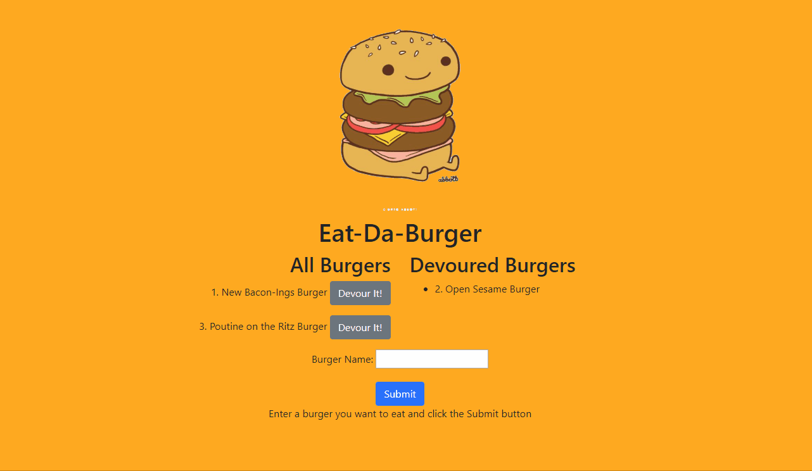
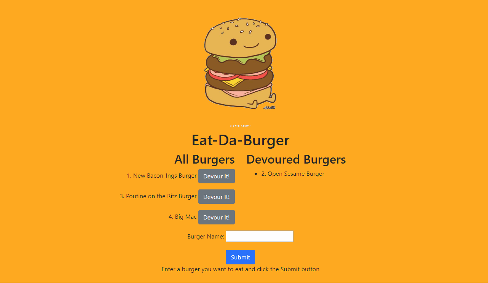

# EAT-DA-BURGER

[Link to Application](https://peaceful-thicket-59214.herokuapp.com/)

### A restaurant app that lets users input the names of burgers they'd like to eat.

## Technologies Used
Express, Node.js, MySQL, Handlebars, Javascript, JQuery, HTML, CSS, Bootstrap, Heroku, JawsDB MySQL

## App Description
Whenever a user submits a burger's name, the app will display the burger on the left side of the page -- waiting to be devoured. Each burger in the waiting area also has a "Devour it!" button. When the user clicks it, the burger will move to the right side of the page.

## *Enter a burger you want to eat and click the "Submit" button*

## *Select the "Devour It!" button to eat the burger and place it to the rightside of the page* 

##### *Deployed on Heroku*